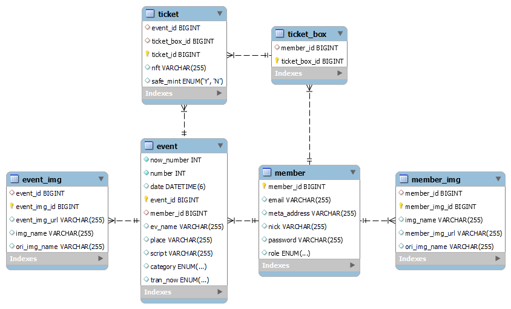

How to Use NFTTicket
==========================
해당 문서에서는 NFTTicket의 시스템 구조 및 설계 및
NFTTicket의 구동에 필요한 요소에 대해 설명한다.

시스템 구조 및 설계
-------------------


NFTTicket은 Spring boot와 JPA, QueryDsl을 통해
만들어진 웹 서비스이다.

mvc 패턴 설명

## DB 구성


데이터의 경우 크게 회원의 Role과 같은 정보가 있는 Member,
행사의 정보가 있는 Event, 행사 참여를 위한 티켓 정보가 있는 Ticket으로 구성되었으며
한 멤버가 소유한 Ticket들을 관리하는 TicketBox
멤버와 행사 이미지 파일 관리를 위한 MemberImg와 EventImg가 존재한다.

각 db 매핑 관계 간략 설명

## 프론트엔드 구성


View의 경우 HTML과 Thymeleaf layout을 통해 만들어 졌으며
header, content, footer의 레이아웃 구성을 가지고 있다.

header 메뉴바 누르면 content 바뀌는 것 설명
AJAX를 사용해 View와 Controller 간 데이터 오고 감 설명


기타 사항
------

해당 프로젝트에서는 DB, 이미지 파일과 관련된 정보들을
application.properties 파일에 저장하여 관리하고 있다.

로컬이기 떄문에 따로 작성하였다 설명
어떻게 썼는지 아래 코드로 보여줄 것

### application-api.properties
```PROPERTIES
# 포트 설정 (원하는 서버 포트 값 입력)
server.port = 80

# MySQL DB 설정 (로컬 컴퓨터 내의 DB 사용)
spring.datasource.driver-class-name=com.mysql.cj.jdbc.Driver
spring.datasource.url=<TYPE YOUR DATASOURCE URL>
spring.datasource.username=root
spring.datasource.password=1234

# 실행되는 쿼리가 출력되도록 설정
spring.jpa.properties.hibernate.show_sql=true
# 쿼리의 가독성을 올리기 위한 포멧팅
spring.jpa.properties.hibernate.format_sql=true
# 쿼리에 물음표로 출력되는 바인드 파라미터 출력
logging.level.org.hibernate.type.descriptor.sql=trace

# DDL AUTO 옵션 설정 ex) create, none ...
spring.jpa.hibernate.ddl-auto=validate
# MySQL8Dialect 설정
spring.jpa.database-platform=org.hibernate.dialect.MySQL8Dialect
# spring-boot-devtools 라이브러리 사용 설정
spring.devtools.livereload.enable=true
# thymealeaf 캐시 설정 (개발 편의성을 위해 false로 설정함)
spring.thymeleaf.cache=false

# 이미지 파일 관련 설정 (사이즈 제한 및 저장 위치)
spring.servlet.multipart.maxFileSize=20MB
spring.servlet.multipart.maxRequestSize=100MB
itemImgLocation=C:/shop1/item
uploadPath=file:///C:/shop1/

#JPA 지연로딩 사이즈 설정
spring.jpa.properties.hibernate.default_batch_fetch_size=1000
```