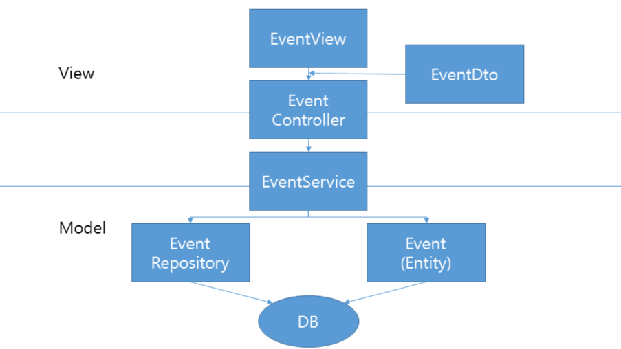
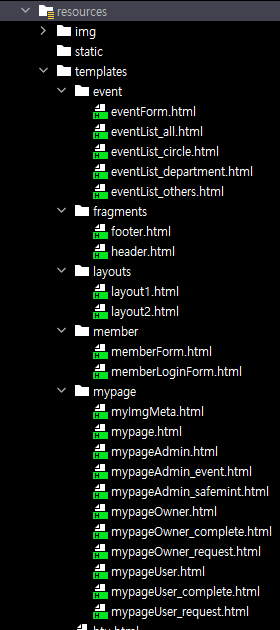

How to Use NFTTicket
==========================
해당 문서에서는 NFTTicket의 시스템 구조 및 설계 및
NFTTicket의 구동에 필요한 요소에 대해 설명한다.

시스템 구조 및 설계
-------------------


NFTTicket은 Spring boot와 JPA, QueryDsl을 통해
만들어진 웹 서비스이다.

사용되어진 디자인 패턴은 MVC 패턴으로 위 사진과 같이
entity와 repository를 통해 데이터 DB에 보내거나 받고 Cotroller와 Service를
통해 프론트와 백 사이에서 데이터를 주고 받는 형태이다.

## DB 구성


데이터의 경우 크게 회원의 Role, MetaMask 지값의 주소값과 같은 정보가 있는 Member,
행사의 정보가 있는 Event, 행사 참여를 위한 티켓 정보가 있는 Ticket으로 구성되었으며

여기에 Member와 1대1 매핑이 되어 한 멤버가 소유한 티켓들을 관리할 수
있도록 한 TicketBox, 
멤버와 행사 이미지 파일 관리를 위한 MemberImg와 EventImg가 존재한다.

## 프론트엔드 구성


View의 경우 HTML과 Thymeleaf layout을 통해 만들어 졌으며
header, content, footer의 레이아웃 구성을 가지고 있다. 해당 서비스에서는
header 부분에 기능들로 이루어진 상단 메뉴바가 있어 원하는 기능을 선택하면
content 부분에 그에 맞는 화면을 노출시키는 방식이다.

데이터 통신의 경우 클라이언트 쪽에서 jQuery를 사용한 AJAX를 통해
요청을 보내면 Spring boot의 Controller에서 요청에 맞게 매핑된 코드를
처리하고 응답을 반환시키는 구조이다.


기타 사항
------

해당 프로젝트에서는 DB, 이미지 파일과 관련된 정보들을
application.properties 파일에 저장하여 관리하고 있다.

하지만 해당 파일은 Github 내에 올라가 있지 않은데 이는
개발에 참여한 팀원들이 각자의 로컬 컴퓨터 환경의 DB를 사용하여
각자 다른 설정값이 적힌 application.properties 파일을 가지고 있었기 때문이다.

따라서 해당 웹 서비스를 정상적으로 작동시키기 위해서는
아래의 application.properties파일을 src/main/resources/application.properties 의 주소에
임의로 작성하여야 한다.

### application-api.properties
```PROPERTIES
# 포트 설정 (원하는 서버 포트 값 입력)
server.port = 80

# MySQL DB 설정 (로컬 컴퓨터 내의 DB 사용)
spring.datasource.driver-class-name=com.mysql.cj.jdbc.Driver
spring.datasource.url=<TYPE YOUR DATASOURCE URL>
spring.datasource.username=root
spring.datasource.password=1234

# 실행되는 쿼리가 출력되도록 설정
spring.jpa.properties.hibernate.show_sql=true
# 쿼리의 가독성을 올리기 위한 포멧팅
spring.jpa.properties.hibernate.format_sql=true
# 쿼리에 물음표로 출력되는 바인드 파라미터 출력
logging.level.org.hibernate.type.descriptor.sql=trace

# DDL AUTO 옵션 설정 ex) create, none ...
spring.jpa.hibernate.ddl-auto=validate
# MySQL8Dialect 설정
spring.jpa.database-platform=org.hibernate.dialect.MySQL8Dialect
# spring-boot-devtools 라이브러리 사용 설정
spring.devtools.livereload.enable=true
# thymealeaf 캐시 설정 (개발 편의성을 위해 false로 설정함)
spring.thymeleaf.cache=false

# 이미지 파일 관련 설정 (사이즈 제한 및 저장 위치)
spring.servlet.multipart.maxFileSize=20MB
spring.servlet.multipart.maxRequestSize=100MB
itemImgLocation=C:/shop1/item
uploadPath=file:///C:/shop1/

#JPA 지연로딩 사이즈 설정
spring.jpa.properties.hibernate.default_batch_fetch_size=1000
```